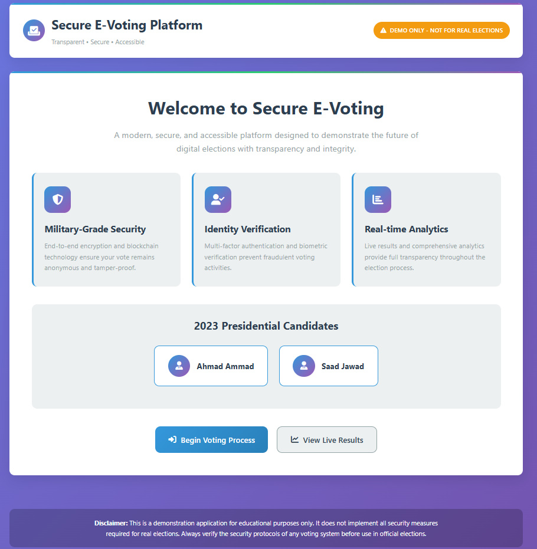

# 🗳️ E-Voting App  

An online voting application built with **Node.js**, **Express**, and **MongoDB**.  
The app uses **OTP verification** to ensure secure authentication and allows users to cast votes between the candidates:  

- **Ahmad Amad**  
- **Abdullah Jawaed**  

# 🗳️ E-Voting App  Screenshot 



---

## 📂 Project Structure  


e-voting-app/
│
├── models/              # MongoDB models
│   ├── User.js          # User schema (with OTP verification support)
│   └── Vote.js          # Vote schema (stores candidate votes)
│
├── node_modules/        # Dependencies (auto-generated)
│
├── public/              # Frontend files
│   ├── index.html       # Home page
│   ├── login.html       # Login / OTP verification page
│   ├── results.html     # Results display page
│   ├── results.js       # Frontend script for fetching results
│   ├── script.js        # Common frontend logic
│   ├── styles.css       # Styling
│   └── voting.html      # Voting page
│
├── routes/              # Express routes
│   ├── auth.js          # Authentication + OTP routes
│   ├── results.js       # Fetching results
│   └── vote.js          # Voting routes
│
├── .env                 # Environment variables (Mongo URI, OTP secrets, etc.)
├── package.json         # Project dependencies & scripts
├── package-lock.json    # Dependency lock file
├── server.js            # Main Express server entry point


---

## ⚙️ Installation & Setup  

### 1. Clone the repository  
```bash
git clone https://github.com/your-username/e-voting-app.git

e-voting-app


3. Setup environment variables

Create a .env file in the root folder and add
# SMTP Configuration for Email OTP
SMTP_HOST=smtp.gmail.com
SMTP_PORT=587
SMTP_USER=your-email@gmail.com
SMTP_PASS=your-email-app-password

# MongoDB Connection
MONGO_URI=your-mongodb-connection-uri

# Session Secret
SESSION_SECRET=your-super-secret-session-key

# Server Port
PORT=3000


4. Run the server
npm start
 
For development (with nodemon):
npm run dev


📦 Example package.json

Below is an example package.json you can use (I used your dependencies from the screenshot and added start and dev scripts):


{
  "name": "e-voting-app",
  "version": "1.0.0",
  "main": "index.js",
  "scripts": {
    "start": "node server.js",
    "dev": "nodemon server.js"
  },
  "keywords": [],
  "author": "",
  "license": "ISC",
  "description": "",
  "dependencies": {
    "bcryptjs": "^3.0.2",
    "cookie-parser": "^1.4.7",
    "dotenv": "^17.2.3",
    "express": "^4.18.2",
    "express-session": "^1.18.2",
    "mongoose": "^8.18.3",
    "nodemailer": "^7.0.6"
  }
}


🚀 Usage

Open http://localhost:3000 in your browser.

Register/Login using OTP verification.

Choose your candidate (Ahmad Amad or Abdullah Jawaed) and cast your vote.

View live results at /results or by opening results.html.


🔒 Security Features

OTP verification before voting

Each user can only vote once

Votes securely stored in MongoDB

.env file used for sensitive keys (not pushed to GitHub)


📊 Future Improvements

Add multiple candidates dynamically

Admin dashboard for monitoring votes

JWT authentication instead of session-based OTP

Deployment on Heroku / Netlify / Vercel + Mongo Atlas


👨‍💻 Author

Developed by Ahmed Ammad